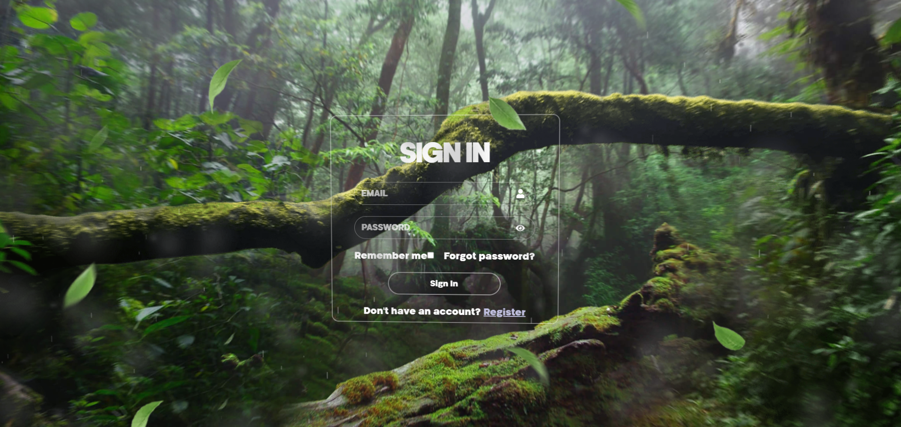

# 🛍️ Cahandar's Login
A beautiful and functional authentication system using React and Supabase.


## 🚀 Features
✅ User Authentication (Sign In, Sign Up, Forgot Password)  
✅ Secure Password Handling with Supabase  
✅ Remember Me Feature  
✅ Modern and Responsive UI  
✅ SweetAlert2 for Interactive Alerts  



## 🛠️ Tech Stack

### Frontend
- ⚛️ React.js  
- 🎨 CSS  
- 🧩 React Icons  
- 🔥 SweetAlert2  

### Backend
- 🛢️ Supabase (PostgreSQL + Authentication)  

---

## 🔧 Installation & Setup
Follow these steps to run the project locally:

1️⃣ **Clone the Repository**  
```sh
git clone https://github.com/Cahandar7/-InternIntelligence_LoginRegister  
cd your-repo
